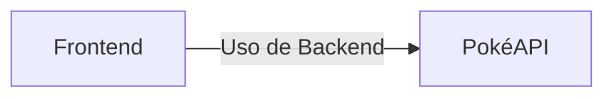
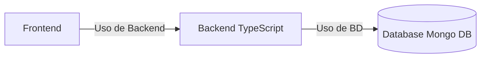

# Pokemon FullStack JS

Desarrollo del:

##### Frontend

- VueJs v2
- Vuex, Vue Router
- JavaScript
- HTML, Sass, Animaciones
- NodeJs v20.9.0
- Uso de backend modular

##### Backend

- ExpressJs
- TypeScript
- NodeJs v20.9.0
- Arquitectura Hexagonal
- MongoDB
- Migraciones de base de datos

## Despliegue

### Método 1

Esta es la forma más sencilla, solo se necesita levantar el frontend y este hará uso del API [https://pokeapi.co/](https://pokeapi.co/) directamente.



Para ello es necesario tener lo siguiente:

#### Requisitos

1. Tener NodeJs v20.9.0
2. Instalar vue2 de forma global

> npm install -g @vue/cli

3. Ubicado en `/frontend`, copiar el `.env.example` y crear un nuevo fichero llamado `.env`. su contenido debe tener:

```bash
VUE_APP_BACKEND=POKEAPI

VUE_APP_POKEAPI=https://pokeapi.co/api/v2
VUE_APP_APIREST=http://localhost:3000
```

El valor de `POKEAPI` de `VUE_APP_BACKEND` hará que el frontend use para el backend el valor de `VUE_APP_POKEAPI`

4. Instalar las dependencias:

> npm install

5. Levantar el proyecto en el puerto 8080 para el modo desarrollo:

> npm run serve

O para producción:

> npm run build

### Método 2

Esta es la forma completa, se usará tanto el frontend, el backend como la base de datos. La base de datos será alimentada con data obtenida del API [https://pokeapi.co/](https://pokeapi.co/).



Para levantar el proyecto es necesario tener lo siguiente:

#### Requisitos

1. Seguir los [pasos anteriores](#requisitos) para levantar el Frontend con la única diferencia que en el `.env` deberá quedar así:

```bash
VUE_APP_BACKEND=APIREST

VUE_APP_POKEAPI=https://pokeapi.co/api/v2
VUE_APP_APIREST=http://localhost:3000
```

De esta forma se usará el backend desarrollado en typeScript.

2. Ubicado en `backend`, copiar el `.env.example` y crear un nuevo fichero llamado `.env`. su contenido debe tener:

```bash
# Server
PORT=3000

# DB
MONGODB_URI=mongodb://localhost:27017/pokemondb
MONGODB_DATABASE=pokemondb
```

3. Instalar dependencias
4. Instalar **typescript** de forma global:

> npm install -g typescript

4. Instalar **migrate-mongo** de forma global:

> npm install -g migrate-mongo

5. Levantar el proyecto en el puerto 3000 (o como esté en el env) para modo desarrollo:

> npm run dev

O para producción:

> npm run build
> npm start
